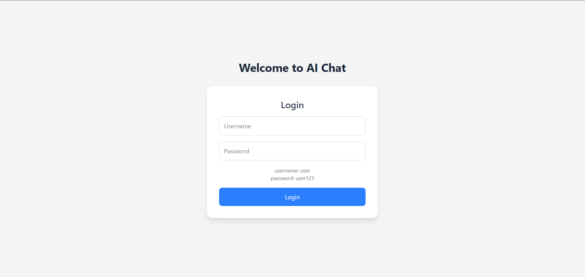
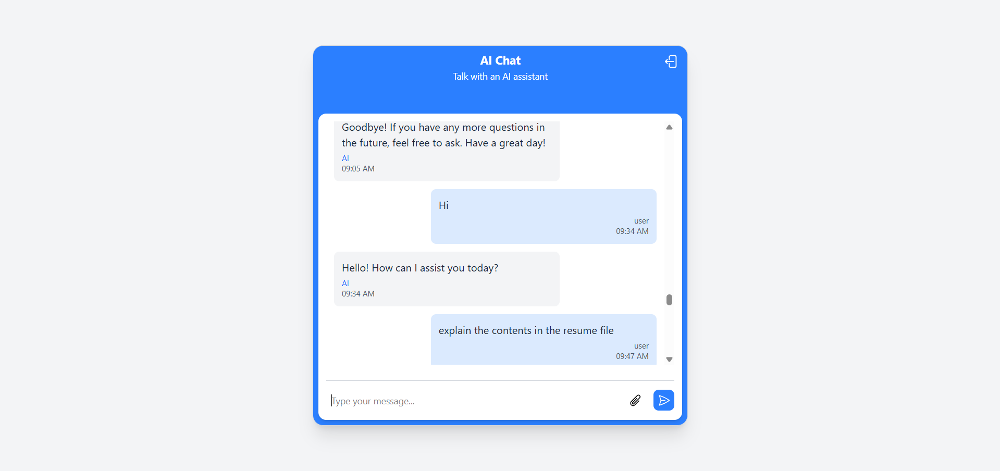

# 🤖 AI Chatbot with Document Upload and FAQ Memory

A full-stack AI-powered chatbot that supports document uploads (PDFs, text files), stores their content in a MongoDB database, and provides intelligent responses to user queries. Built using **React**, **Node.js**, **Express**, **MongoDB**, and **Azure OpenAI GPT-35-Turbo**.

---

## 📚 Table of Contents

- [Features](#-features)
- [Tech Stack](#-tech-stack)
- [Environment Variables](#️-environment-variables)
- [Getting Started](#-getting-started)
- [ScreenShots](#-screenshots)
- [Contributing](#contributing)

---

## 📌 Features

- ✅ JWT Authentication with secure login/logout
- ✅ User can upload `.pdf` and `.txt` files
- ✅ Text extracted from files is stored and chunked in MongoDB
- ✅ AI assistant answers queries using:
- ✅ Context from uploaded documents (via basic string matching)
- ✅ Azure OpenAI GPT-35-Turbo
- ✅ Chat history is stored per user
- ✅ RESTful API with secure routes
- ✅ File upload with `multer`
- ✅ Cross-Origin Cookie-based authentication

---

## 🧠 Tech Stack

### Frontend

- React
- MobX for state management
- Tailwind CSS
- Axios for API calls

### Backend

- Node.js + Express
- MongoDB with Mongoose
- Multer for file uploads
- Azure OpenAI GPT-35-Turbo
- JWT for secure authentication

---

## ⚙️ Environment Variables

```env
PORT=3000
MONGO_URI=mongodb://url/ai-chatbot
JWT_SECRET=your_jwt_secret
FRONTEND_URI=FRONTEND_URI
AZURE_OPENAI_KEY=your_azure_api_key
AZURE_OPENAI_ENDPOINT=your_azure_openAI_endpoint
AZURE_DEPLOYMENT_NAME=your_azure_deployment

```

## 🚀 Getting Started

### 🔧 Setup

```bash
# Clone the repo
git clone https://github.com/saisaurav78/AI_ChatBot
cd AI_ChatBot

# Backend
cd server
npm install
npm run dev

# Frontend (in another terminal)
cd frontend
npm install
npm run dev

# Login Credentials
Username: user
Password: user123
```

## 📸 Screenshots

### Login Page


### Chat with AI


## Contributing
Contributions are welcome! If you have suggestions or improvements, please open an issue or submit a pull request.